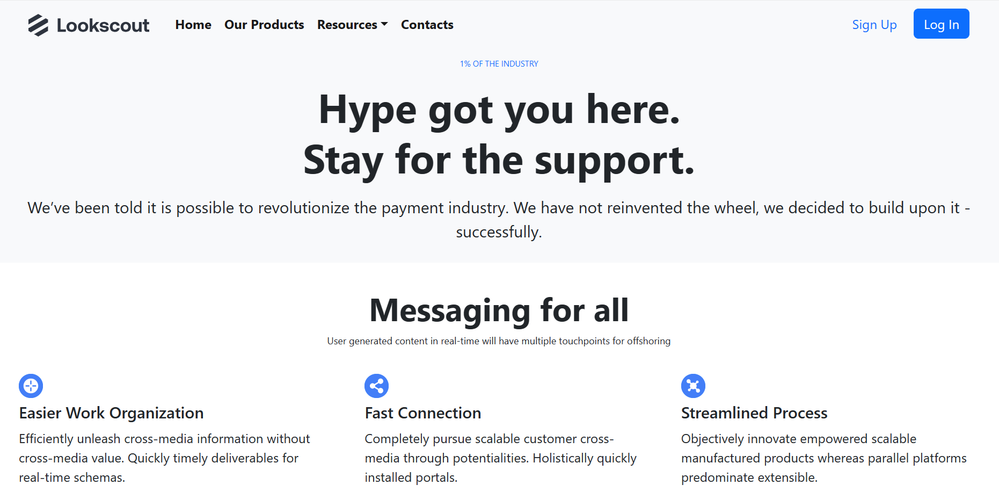

# Looksout: A MERN Stack App

## Description
Looksout is a web application built using the MERN (MongoDB, Express.js, React, Node.js) stack. It allows users to navigate through the full-stacked website seamlessly.

## Installation
### Frontend
1. Clone the repository:

   git clone <repository_url>

2. Navigate to the frontend folder:

   cd frontend

3. Install dependencies:

   npm install

4. Create a `.env` file in the frontend folder with the following content:

   REACT_APP_BACKEND_URL=http://localhost:8080/

5. Run frontend

    npm start

### Backend
1. Navigate to the backend folder:

   cd backend

2. Install dependencies:

   npm install

3. Create a `.env` file in the backend folder with the following content:

   MONGODB_URI=mongodb+srv://<username>:<password>@lookscoutcluster.vck7iwl.mongodb.net/LookscoutDB?retryWrites=true&w=majority&appName=LookscoutCluster 
   FRONTEND_URL=http://localhost:3000

4. Run backend

    npm run dev

## Deployment
### Vercel Deployment (Frontend)
1. Choose "Create React App" as the project type.
2. Point Vercel to the frontend folder.
3. Configure environment variables (as above).
4. Deploy!

### Vercel Deployment (Backend)
1. Choose "Other" as the project type.
2. Point Vercel to the backend folder.
3. Configure environment variables (as above).
4. Deploy!

## Note
Remember to replace the placeholders (<repository_url>, <username>, <password> etc.) with the actual values relevant to your project.

## License
## Copyright
© 2024 RaaZ Khanal

